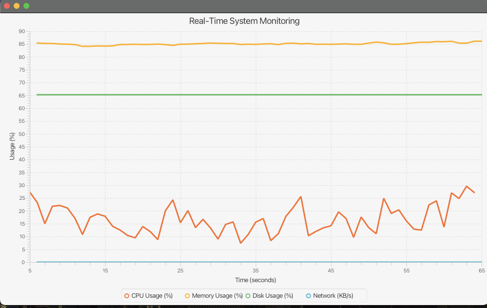

# System Monitor

A Java-based system monitor that tracks key system metrics and alerts users to potential problems.
Currently I have built this system monitor to track CPU usage, memory usage, disk space usage, and network connectivity. It uses the OSHI API for gathering operating system information. 

## Features
* Tracks CPU usage, memory usage, disk space usage, and network connectivity.

## Future implementations
* Alerts users to potential problems via email or desktop notifications
* Configurable thresholds and alerting mechanisms

## Requirements

* Java 8 or later
* Gradle for building and dependencies

## Building and Running

To build and run the system monitor, follow these steps:

1. Clone the repository: `git clone https://github.com/1927-med/system-monitor.git`
2. Change into the project directory: `cd system-monitor`
3. Build the project using Gradle: `./gradlew build`
4. Run the system from IDE or terminal `./gradlew run`
5. Run the system monitor for jar: `java -jar target/system-monitor-1.0-SNAPSHOT.jar`

## Configuration

The system monitor can be configured using a properties file. See the `config.properties` file for an example.

## Contributing

Contributions are welcome! Please submit a pull request with your changes. 

## License

This project is licensed under the MIT License - see the [LICENSE](LICENSE) file for details.

